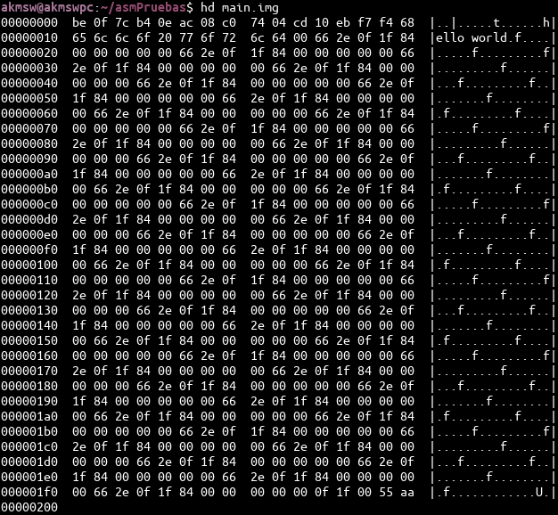
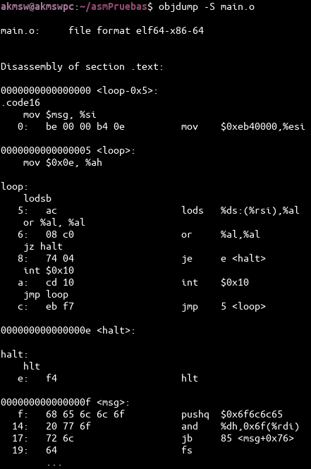
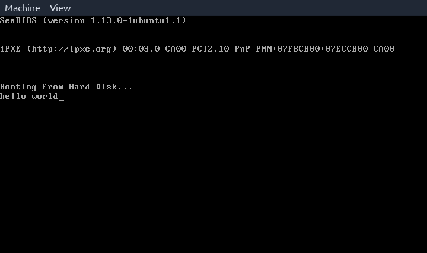
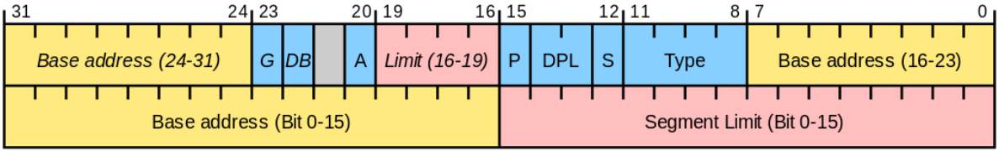
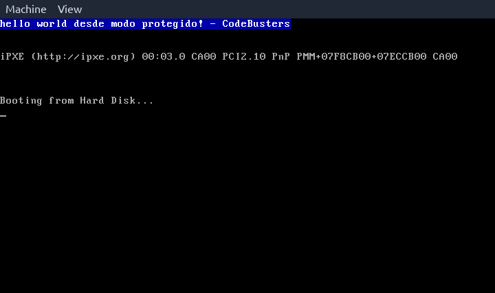

# Real mode & protected mode

## Group members
- Luna, Lihué Leandro
- Bonino, Francisco Ignacio

## UEFI & coreboot
- ¿Qué es la ***UEFI***?
    - La UEFI (Unified Extensible Firmware Interface) es un tipo de BIOS moderno. Es una interfaz entre el sistema operativo y el firmware, que puede soportar sistemas de 32 y 64 bits y un entorno previo al booteo del sistema operativo mucho más amigable ya que incluye una interfaz gráfica, soporte para mouse e incluso animaciones. Su programación es mucho más fácil porque puede ser desarrollada en lenguaje `C`. Una de sus mayores ventajas frente al BIOS es que puede bootear discos con particiones mayores a 2TB, haciendo uso de tablas de partición GPT. Posee una shell para el diagnóstico y búsqueda de errores. Además, la UEFI ofrece un modo de inicio seguro, el cual ayuda a detener posible software malicioso.
- ¿Cómo se puede usar la UEFI?
    - Para acceder a la UEFI se debe verificar cuál tecla ha sido asignada a nuestro sistema para entrar a modo UEFI, y presionarla durante el proceso de ***Power On Self Test*** (POST) antes de iniciar el sistema operativo.
- Mencionar una función de la UEFI a la que podría llamar.
    - Con respecto a los comandos ejecutables desde la EFI shell, se halló [una tabla](https://docstore.mik.ua/manuals/hp-ux/en/5991-1247B/ch04s13.html) muy completa con varios comandos y sus descripciones. Hay comandos relacionados al booteo desde una partición particular, otros relacionados a la obtención y modificación de información de las particiones, otros para manejar dispositivos y drivers, y muchas otras funcionalidades.
    - Por otro lado, también es posible desarollar software para UEFI gracias a la librería *gnu-efi*, la cual provee al programador una serie de funciones y estructuras para hacer menos tediosa la labor del desarrollo de software de tan bajo nivel. [Aquí](https://www.rodsbooks.com/efi-programming/hello.html) se puede consultar un ejemplo de creación, compilación y ejecución de un programa "hello world" para UEFI.
- Mencionar casos de *bugs* de UEFI que puedan ser explotados.
    - Recientemente se han descubierto [tres vulnerabilidades](https://blog.root-view.com/bugs-del-firmware-uefi-de-lenovo-afectan-a-millones-de-portatiles/) de UEFI de alto impacto en algunos equipos portátiles de Lenovo. Estas vulnerabilidades afectan los drivers de firmware que, en principio, sólo se utilizan durante el proceso de fabricación, pero se incluyeron por error en las imágenes de producción sin ser desactivadas correctamente. La explotación de estas vulnerabilidades podría permitir a un atacante deshabilitar las protecciones flash SPI o el arranque seguro, otorgando la capacidad de instalar malware persistente que puede sobrevivir a los reinicios del sistema. Estas vulnerabilidades afectan a las líneas Lenovo Flex, IdeaPad, Legion y Yoga.
- ¿Qué es el ***Converged Security and Management Engine*** *(CSME)*?
    - El CSME es el sucesor de la MEBx, una versión nueva y mejorada introducida en el 2017. El CSME es un subsistema autónomo incorporado virtualmente por los chipsets de procesadores Intel. Su propósito es el de actuar como controlador de seguridad y manejo en el PCH (Platform Controller Hub). Algunas de sus funciones principales son:
        - Servir de configurador de clocks y GPIO.
        - Autenticación y carga de firmware en su hardware correspondiente.
        - Limitar a los usuarios el acceso al nivel de hardware.
    - Se puede consultar su [white paper](https://www.intel.com/content/dam/www/public/us/en/security-advisory/documents/intel-csme-security-white-paper.pdf) para obtener mucha información más detallada sobre su funcionamiento.
- ¿Qué es la ***Intel Management Engine BIOS Extension*** *(Intel MEBx)*?
    - La MEBx es la predecesora del CSME. Su propósito era el mismo, pero es una versión más antigua y con menos funcionalidades.
- ¿Qué es el ***coreboot***?
    - El coreboot (más conocido como LinuxBIOS) es una alternativa de código abierto (open source) a estos firmwares. Como debe ser ejecutado directamente en la motherboard, debe ser compatible con sus chipsets. Esto implica que no está disponible para cualquier modelo de motherboard, sino para algunos modelos específicos.
- ¿Qué productos incorporan el coreboot?
    - Compañías como Purism, System76 y Star Labs incorporan en sus dispositivos la alternativa coreboot.
- ¿Cuáles son las ventajas de la utilización del coreboot?
    - Algunas de las ventajas que ofrece coreboot son:
        - Mayor rapidez en el arranque del sistema.
        - Evitar adware de los fabricantes.
        - Mayor robustez en cuanto a detección y prevención de malware.
        - Mejor gestión de energía en dispositivos portátiles.

## Linker
- ¿Qué es y qué hace un ***linker***?
    - El linker es un programa que toma uno o varios ficheros de tipo *objeto* (`.o`, `.obj`) generados a partir de un compilador y los combina en un único archivo ejecutable en forma binaria que englobará las instrucciones que debe ejecutar el procesador.
- ¿Qué es la dirección que aparece en el script del linker?
    - La dirección de memoria `0x7c00` indica una posición de memoria absoluta a partir de la cual se buscarán 512 bytes —correspondientes al Master Boot Record (MBR)—, especificando las instrucciones de arranque del sistema operativo y la tabla de particiones del dispositivo de almacenamiento.
- ¿Por qué es necesaria esta dirección?
    - Esta dirección de memoria proviene de la primera generación de chips 8088 de Intel. Para mantener compatibilidad, los CPUs subsiguientes han mantenido la utilización de esta dirección para cargar el MBR.
    - Cuando se utilizaban estos chips, el sistema operativo era 86-DOS. Este OS necesitaba un mínimo de 32KB de memoria, lo cual representamos en el rango hexadecimal `0x0000 — 0x7fff`.
    - El chip 8088 ocupa desde `0x0000` hasta `0x03ff` para almacenar handlers de interrupciones, por lo que el rango de memoria utilizable que resta es `0x0400 — 0x7fff`.
    - Para dejar al OS la mayor cantidad de memoria contigua para utilizar, se decidió poner al MBR tan "alejado" como se pueda. Para esto, sabiendo que el MBR ocupa 512 bytes (`0x200`) y que se necesitan 512 bytes adicionales para información generada por el MBR, se eligió la posición del MBR 1024 bytes antes del límite de memoria. De esta forma: `0x7fff - 0x200 - 0x200 + 1 = 0x7c00`.
    - Artículos consultados:
        - [*Why BIOS loads MBR into 0x7c00 in x86?*](https://www.glamenv-septzen.net/en/view/6)
        - [*Why the memory address of the master boot record is 0x7c00?*](https://www.programmersought.net/en/article/324458798.html)
- Compare la salida de `objdump` con `hd` y verifique dónde fue colocado el programa dentro de la imagen.
    - Primero, vemos el output del comando `hd`:\

    - Ahora, el output del comando `objdump`:\

    - Analizando línea a línea, podemos observar que, a pesar de que el programa en la imagen esté cargado en la posición `0x00000000`, el linker se encargará de colocarlo a partir de la posición `0x7c00` para que pueda ser tratado como un MBR.
- Grabar la imagen en un pendrive, probarla en una PC y subir una foto.
    - A pesar de haber intentado múltiples veces de muchas formas distintas en varios dispositivos, no fue posible conseguir con éxito el correcto booteo del MBR con el programa "hello world" en una PC. Sin embargo, con el emulador `qemu` se obtuvieron resultados exitosos, como se muestra a continuación:\

- ¿Para qué se utiliza la opción `--oformat binary` en el linker?
    - De acuerdo con [las páginas del manual para el comando `ld`](https://linux.die.net/man/1/ld), la opción `--oformat` se utiliza para especificar el formato del archivo objeto resultante. En este caso, especificamos que luego del linking, el archivo generado será un archivo binario.

## Protected mode
- El programa desarrollado en assembly que pasa a modo protegido se encuentra en el archivo `tp3.asm`. Se puede compilar y ejecutar aprovechando el archivo *makefile* con el comando `make`.
    - A continuación se proporciona una breve explicación secuencial de lo que se realiza en el código:
        - Se deshabilitan las interrupciones.
        - Se cargan las direcciones de memoria de la GDT.
        - Se pone a 1 el bit menos significativo del registro `CR0` para pasar a modo protegido.
        - El diagrama de la tabla global de descriptores que se implementó es como el siguiente:

        - Estando en modo protegido, se actualizan los valores de los registros de segmento `DS`, `ES`, `FS`, `GS` y `SS`.
        - Se configura la memoria de video VGA y se muestra un mensaje personalizado en pantalla.
            - Se eligió contrastar el texto de color blanco con un fondo de color azul. La configuración para lograr esto se puede hallar [aquí](https://wiki.osdev.org/Printing_To_Screen).
            - Podemos confirmar que estamos en modo protegido porque se asigna al texto a imprimir la dirección de memoria `0xb8000` que es la correspondiente en modo protegido a VGA para monitores multicolor, y se muestra donde queremos, como se muestra a continuación:

- Si un programa tiene el código y los datos en direcciones independientes de la
memoria física, debe indicarse con 2 entradas en la tabla GDT, cada una denotando una base de segmento, a la cual se añade el offset o desplazamiento para obtener la dirección de la memoria principal de las instrucciones y datos de ese programa.
- En caso de que la tabla GDT se defina con segmento de datos de sólo lectura, cuando se intente escribir en la memoria el mensaje, se activará la bandera de interrupción `IF`, del registro `EFLAGS`, impidiendo la ejecución del código restante, quedando en un bucle infinito.
- En modo protegido, los registros de segmento se cargan con el valor `0x10`, que representa el número 16 en decimal, que es la cantidad de bytes que se deben dejar disponibles en la tabla GDT para almacenar el descriptor nulo (que no se utiliza de acuerdo a la documentación) y el descriptor de código que se carga primero.